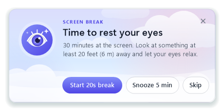
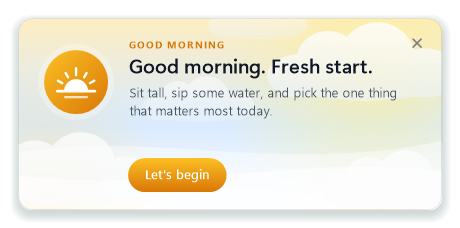
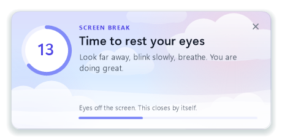
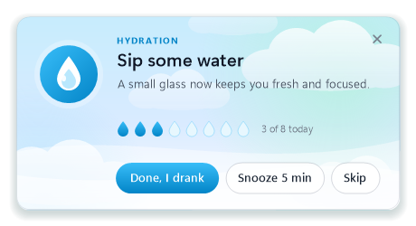
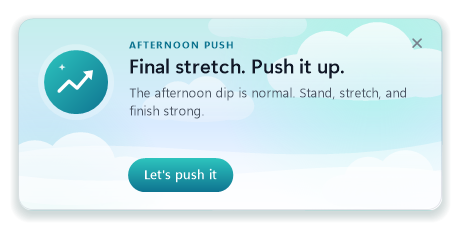

<div align="center">

# ☁️ Drift

**Gentle reminders to rest your eyes and drink some water, without breaking your flow.**




[**Download**](https://github.com/rk-354/drift/releases/latest) · [What it does](#-a-day-with-drift) · [Install](#-install-in-30-seconds) · [FAQ](#-faq)

</div>

<br>

Drift lives quietly in your system tray. Every so often a soft card drifts up from the corner of the screen to remind you
to look away, take a sip, or take a breath. Then it gets out of the way.

There is nothing to install and no account to create. It doesn't need admin rights, never uses the internet, and stores
nothing outside your own PC.

<br>

## 🌤 A day with Drift

<table>
<tr>
<td width="50%" valign="top">

**10:00 · Good morning**<br>
<sub>A fresh-start nudge: sit tall, sip some water, and pick today's one priority.</sub>



</td>
<td width="50%" valign="top">

**Every 30 min · Rest your eyes**<br>
<sub>Look 20 feet away for 20 seconds. Press Start and the eye becomes a countdown ring.</sub>



</td>
</tr>
<tr>
<td width="50%" valign="top">

**Every 60 min · Sip some water**<br>
<sub>A row of droplets fills up as you go, against your daily target.</sub>



</td>
<td width="50%" valign="top">

**16:00 · Afternoon push**<br>
<sub>The dip is normal. Stretch, refocus, finish strong.</sub>



</td>
</tr>
</table>

> The morning and afternoon cards each have **14 wordings with the same meaning**. A different one appears each day, so
> the cards never feel stale.

<br>

## ✨ Why it doesn't get annoying

|  |  |
|---|---|
| 🫧 **Never steals focus** | Cards appear without taking the keyboard, so you can keep typing mid-sentence. |
| 🎬 **Knows when you're busy** | It waits while you are presenting, watching full-screen video, or running anything full screen. |
| ⏸️ **Easy to pause** | Pause for 30 min, 1 h, 2 h, or until tomorrow, straight from the tray. |
| 🕊️ **One card at a time** | Reminders queue politely instead of stacking up. |
| ☀️ **Daily cards once a day** | The morning and afternoon cards appear once each. If your PC was off at 10:00, the morning card still appears until 13:00. |
| 🔒 **Private by design** | No network, no telemetry. Your history stays in `%APPDATA%\Drift` on your own PC. |

<br>

## 🚀 Install in 30 seconds

1. **[Download Drift.zip](https://github.com/rk-354/drift/releases/latest)** and unzip it anywhere.
2. Open the `Drift` folder and double-click **`install.cmd`**.
3. A message confirms Drift is running. Look for the 💧 near the clock.

That's it. Drift now starts by itself every time you sign in, and you can delete the unzipped folder.

> [!TIP]
> Don't see the drop? Windows 11 tucks new tray icons behind the **^** arrow on the taskbar. Drag the drop out onto the
> taskbar so it's always visible.

<br>

## 🎛 The tray menu

Right-click the drop:

```
  Take a break now
  I drank a glass of water
  Water reminder now
  Preview daily cards     ▸  Morning · Afternoon
  ─────────────────────
  Pause reminders         ▸  30 min · 1 h · 2 h · until tomorrow
  ─────────────────────
  Today and this week…       your water & break summary
  Settings…
  Exit
```

<br>

## ⚙️ Make it yours

Everything is adjustable in **Settings**:

| Setting | Default |
|---|---|
| Screen-break reminder | every **30 min** |
| Guided break length | **20 s** |
| Water reminder | every **60 min** |
| Daily water target | **8** glasses |
| Snooze | **5 min** |
| Morning card | **on**, 10:00 |
| Afternoon card | **on**, 16:00 |
| Sound | **on** |
| Start with Windows | **on** |

<br>

## 💬 FAQ

<details>
<summary><b>Windows says "Windows protected your PC". Is it safe?</b></summary>
<br>
Windows shows that warning for any script that came from email or the web. Click <b>More info</b> and then <b>Run
anyway</b>. Drift is one plain, readable PowerShell script of about 1,300 lines. You can open <code>drift.ps1</code> in Notepad and
read every line before you run it.
</details>

<details>
<summary><b>Do I need admin rights?</b></summary>
<br>
No. Drift installs to <code>%LOCALAPPDATA%\Programs\Drift</code> and adds itself to your own Startup folder. Nothing is
written outside your user profile.
</details>

<details>
<summary><b>How do I update it?</b></summary>
<br>
Download the newer zip and run its <code>install.cmd</code>. It replaces the old version in place and keeps your settings
and history.
</details>

<details>
<summary><b>How do I remove it?</b></summary>
<br>
Search the Start menu for <b>Drift</b>, right-click it and choose <b>Open file location</b>, then run
<code>uninstall.cmd</code>. Your history in <code>%APPDATA%\Drift</code> is kept, so delete that folder too if you want
a clean slate.
</details>

<details>
<summary><b>Will it pop up during my presentation?</b></summary>
<br>
No. When Windows reports that you are presenting or something is running full screen, Drift holds every reminder until
you are done.
</details>

<br>

## 🛠 Under the hood

- **PowerShell 5.1 + WinForms only.** Both ship with every Windows 10 and 11 machine, so there are no dependencies.
- **The cards are hand-drawn in C#**, compiled on the fly with `Add-Type`. That gives the pastel sky, drifting clouds and
  flowing waves, rounded corners, a soft shadow, the countdown ring and a fade-in, with no flicker.
- **Crisp on high-DPI screens.** The process is DPI-aware, so text stays sharp at 125 % and 150 % scaling.
- **The scheduling logic is self-tested:**

  ```powershell
  powershell -ExecutionPolicy Bypass -File drift.ps1 -SelfTest
  ```

- **Try it with short intervals:** `wscript Start-Drift.vbs demo` shows a break after 1 minute and water after 2.

<details>
<summary><b>Project layout</b></summary>

```
drift.ps1          the app: tray, scheduling, cards, settings
Start-Drift.vbs    starts it with no console window
install.cmd        one-click install / update   → install.ps1
uninstall.cmd      one-click removal            → install.ps1 -Uninstall
docs/              the card images in this README
```
</details>

<br>

<div align="center">
<sub>Made with ☁️ for screen-heavy days · look away, sip, breathe.</sub>
</div>
